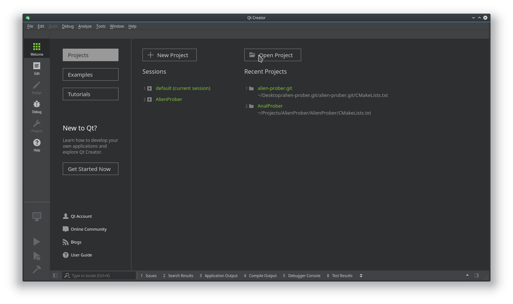
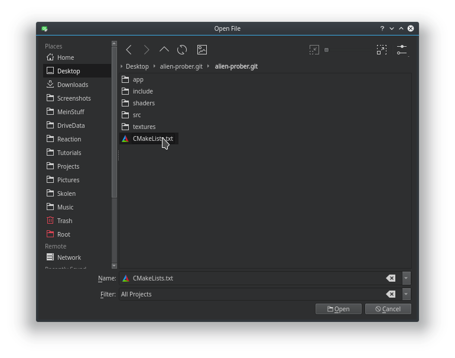
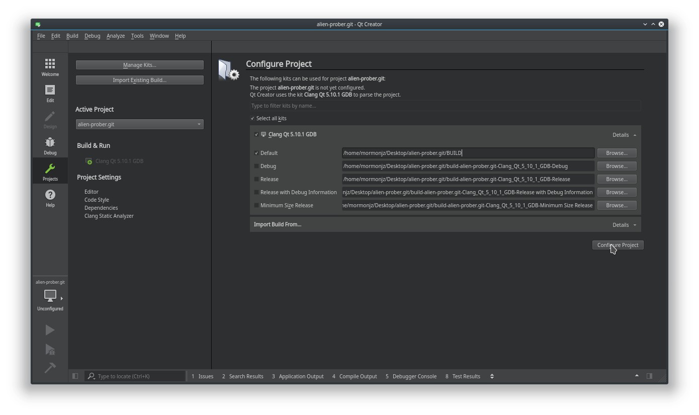
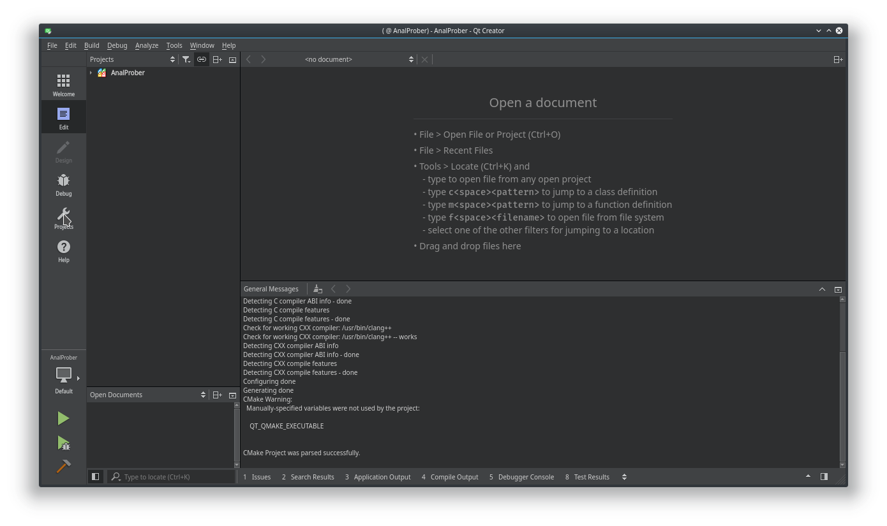
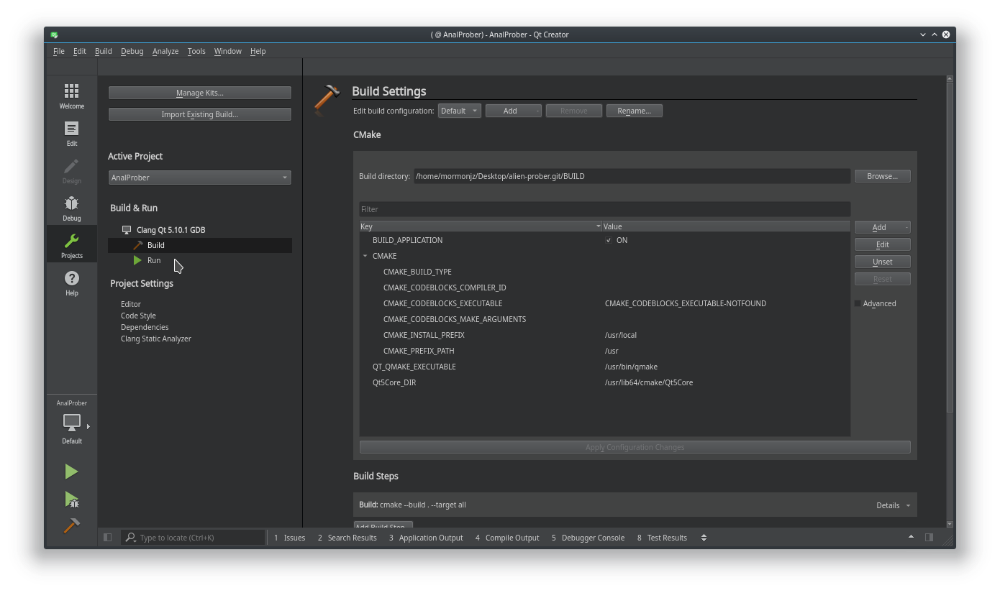
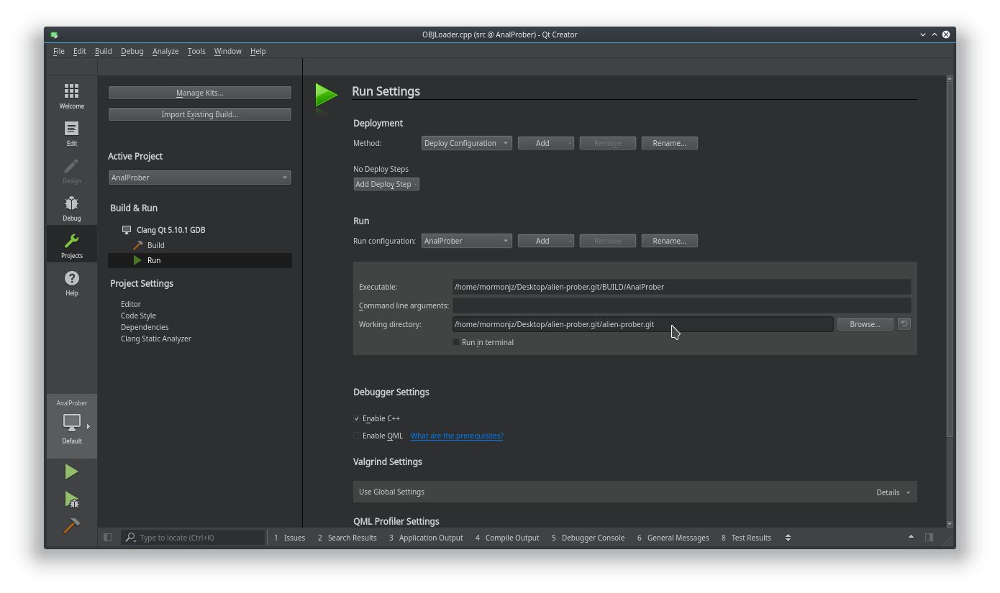

# Alien Prober
This is my project for the course STE6249-001-1 18V Virtual Reality. Game itself is a 3D version game inspired by Space Invaders. 

## Getting Started
These instructions will get you a copy of the project up and running on your local machine for development and testing purposes.  
***NB*** If you are unable to run the game on your PC you can see the video showing off the game here: [YouTube video](https://youtu.be/9h6zUjahnKE) or in the project folder.

### Prerequisites
You need to have `QtCreator` installed on your PC as well as `Clang` and `C++` libraries. Other libraries required are: `glm`, `glu`, `freeglut`, `lib32-glu`, `lib32-freeglut`, and `soil`.

#### UNIX based systems
Arch: `sudo pacman -S glm glu freeglut lib32-glu lib32-freeglut soil`  
Debian: `sudo apt-get install libglm-dev  libglu1-mesa-dev freeglut3 libsoil-dev`  

I am unsure if Debian packages are correct as I use Arch system myself.  
**IMPORTANT** `glm` cannot be of version 0.9.9.0 or later, it can be at latest of version 0.9.8.5-2, since in version 0.9.9.0 they changed how vectors and matrices are initialized.

##### Downgrading glm
In order to downgrade glm you will need to do following on Arch:
```bash
sudo pacman -S downgrade
sudo downgrade glm
```
You will then be asked to choose a specific version from the list. Choose version 0.9.8.5-2 and press enter to confirm.  
On Debian systems this can be achieved by running:
```bash
sudo apg-get install libglm-dev=0.9.8.5-2
```

## Running the game
To run the game you will need to download the project and unzip it somewhere in your system. Then open QtCreator and choose the *Open Project* button. After that navigate to the project folder and choose the `CMakeLists.txt` file.


  

On the following screen you will be asked to configure the project, choose a kit that uses `Clang` as a compiler and setup the project to look something like you see on the screenshot. Confirm by clicking on `Configure Project`.

  

After that choose the `Projects` tab on the left. On the `Build & Run` menu choose `Run`, and set the project root folder as the `Working Directory`. 



  

Now you can run the application on your PC.

## Controls
`W` `A` `S` `D` keys for movements.  
`Spacebar` key for pausing the game.  
`1` `2` keys to change weapons.  
`Left mouse button` fire weapons.

## Setting
Game is set on another planet with strange enemy ships made of colours (couldn't find a low poly model with textures) and mercury lakes that reflect the purple skies of this alien planet.

## Built With
* [QtCreator](https://www.qt.io/) - C++ IDE.
* [OpenGL](https://www.opengl.org/) - Graphics rendering system.
* [GLM](https://glm.g-truc.net/0.9.9/index.html) - OpenGL Mathematics.
* [FreeGLUT](http://freeglut.sourceforge.net/) - Free-Software alternative to OpenGL Utility Toolkit.
* [SOIL](https://www.lonesock.net/soil.html) - C library for uploading textures to OpenGL.

## Authors
***Daniel Salwerowicz*** - *Developer* - [MormonJesus69420](https://github.com/MormonJesus69420)

## Contributors
***Kent Arne Larsen*** - Co-student  
***Christopher Kragebøl Hagerup*** - Co-student  
***Victor Lindbäck*** - Co-student  
***Olav Kjartan Larseng*** - Co-student  

## License
This project is licensed under the WTFPL License - see the [LICENSE.txt](LICENSE.txt) file for details.
